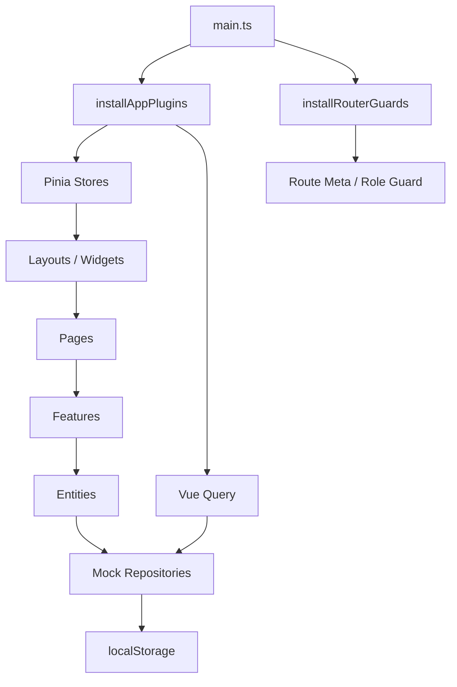

# Vue3-Frontend-Architecture-Mastery-Dashboard

> 一个纯前端的 Vue 3.5 + Vite 8 学习模板，目标不是“做一个能提交的后台”，而是帮助基础 HTML/CSS 开发者彻底理解现代 Vue 中后台的目录结构、组件拆分、数据流、状态管理、路由策略和布局系统。

## 技术栈为什么这样选

- `Vue 3.5 + <script setup>`：当前主流 Vue 写法，组合式 API 更适合拆分逻辑和复用状态。
- `Vite 8`：开发启动快，配置轻，足够适合纯前端模板。
- `TypeScript strict`：把类型约束前置，减少学习时“写着写着就乱了”的情况。
- `Pinia + 持久化`：负责登录态、主题、布局偏好和标签页状态，能完整展示现代前端状态管理方式。
- `Vue Router 4.6`：配合路由守卫、菜单过滤和异常页，演示真实后台最常见的路由策略。
- `Element Plus`：中后台结构最常见的 UI 基座，适合学习表单、表格、分页、弹窗和布局。
- `Tailwind CSS + UnoCSS`：一个负责常规 utility，一个负责补充原子能力和快速样式表达，适合学习“工程化 CSS 组合”。
- `@tanstack/vue-query`：把数据获取、缓存、失效和刷新逻辑从页面里抽出去，即使数据是 Mock 的，也能学到真实项目的数据层写法。
- `VueUse`：提供 `useBreakpoints`、`usePreferredDark`、`watchDebounced` 等常用 hooks，让页面逻辑更贴近实际项目。

## 架构图



## `src/` 目录说明

| 目录 | 作用 |
|---|---|
| `src/app` | 应用启动相关代码，例如插件安装、主题同步、全局初始化。 |
| `src/layouts` | 登录页布局、后台壳子布局。布局只负责“框架”，不写具体业务。 |
| `src/pages` | 页面级路由视图。每个页面尽量薄，只做组合，不堆业务细节。 |
| `src/widgets` | 页面级大块组件，例如后台侧边栏、顶部栏、标签页、仪表盘模块。 |
| `src/features` | 可复用业务能力，例如登录表单、用户表格、复杂表单、设置面板。 |
| `src/entities` | 领域实体、类型定义和本地 Mock 仓库，例如用户、会话、仪表盘数据。 |
| `src/shared` | 通用工具、组合式函数、基础 UI、Mock 辅助、路由/权限工具。 |
| `src/stores` | Pinia 状态模块，负责 auth、layout、settings 这类全局状态。 |
| `src/router` | 路由表、守卫和路由相关工具。 |
| `src/styles` | 全局样式、主题变量、背景和动画。 |
| `src/tests` | 测试初始化文件和最小单测。 |

## 页面一览

- 登录页：模拟 JWT token 存入 Pinia，支持角色选择。
- 后台布局：侧边栏、顶部栏、标签页、面包屑、响应式侧边栏。
- 仪表盘：首页统计卡片、Mock 图表、最近动态。
- 用户管理：表格、分页、搜索、增删改查 Mock。
- 表单示例：复杂表单、校验、表单提交结果展示。
- 设置页：主题切换、布局密度、标签页开关、权限演示入口。
- 404 页面：同时承接“找不到页面”和“权限不足”这两类异常。

## 为什么这个结构适合学习

1. 先看 `app` 和 `router`，能理解应用是怎么启动和守卫的。
2. 再看 `layouts` 和 `widgets`，能理解后台壳子如何复用。
3. 再看 `features`，能理解“业务能力”和“页面”是怎么分离的。
4. 再看 `entities` 和 `shared`，能理解数据层、Mock 仓库和通用工具如何服务上层。
5. 最后看 `pages`，你会发现页面本身其实很薄，真正复杂的东西都被拆掉了。

## 运行方式

```bash
npm install
npm run dev
```

常用命令：

```bash
npm run typecheck
npm run test:run
npm run build
```

## 学习路径建议

1. 先登录一次，观察 token、用户信息和角色是怎么进入 Pinia 的。
2. 切到仪表盘，顺着 `PageShell -> DashboardSummary -> StatCard` 看组件怎么组合。
3. 进入用户管理，跟着 `Vue Query -> repository -> localStorage` 看数据层怎么流动。
4. 进入设置页，观察主题切换、标签页和侧边栏状态如何持久化。
5. 切换不同角色，体验路由守卫和菜单过滤的联动效果。
6. 最后回到 `README` 的目录表，按目录逐层理解每一层为什么存在。

## 常见问题

### 1. 为什么不用后端？

因为这个模板的目标是先让你理解现代前端架构，而不是先被接口联调分散注意力。所有数据都来自本地 Mock 仓库，学习成本更低。

### 2. 为什么不用 Nuxt？

这个项目故意保持纯 Vite + Vue 3，但结构上借用了 Nuxt 的 App Router 风格。这样你能学到类似的目录思想，又不会被框架内置约束绑死。

### 3. 为什么路由不是完全自动生成？

为了学习清晰，路由表是显式的。你可以一眼看到每个页面、守卫和权限如何配置。

### 4. 为什么图表是自绘 SVG？

这是一个学习模板，不是为了引入更多依赖。自绘 SVG 更轻、更容易读懂，也更方便以后替换成真实图表库。

### 5. Pinia 持久化保存了什么？

保存了登录态、用户信息、主题和布局偏好，以及后台标签页状态。刷新后这些设置仍然存在。

## 代码约定

- 业务逻辑优先放到 `features`、`entities` 和 `stores`，页面尽量保持薄。
- 关键代码都写了“为什么这样设计”的注释。
- 所有数据层都只读写本地存储，不做真实网络调用。
- 角色和守卫逻辑优先写在路由层，不要散落在各个页面里。

